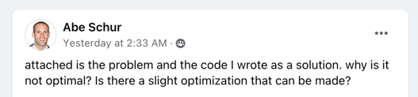
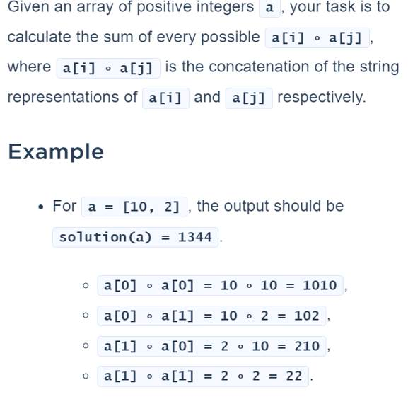
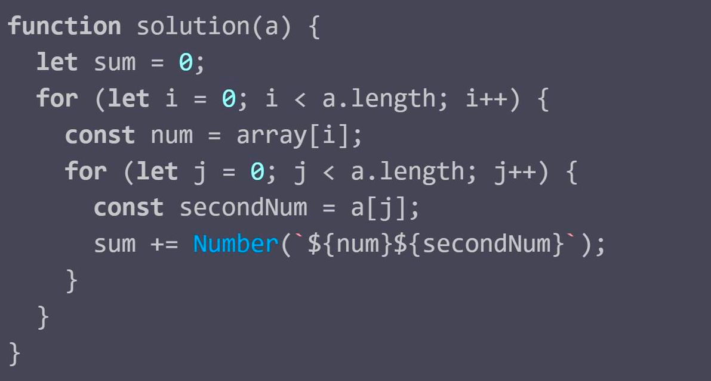

# Sum of Concatenation
This problem was inspired by a post on the Computer Science Educators group on Facebook. I suspect that the problem originated on Code Dojo or a similar site.

##Problem Statement

#Original Solution
This was the solution created by the original poster. Note that this soultion is correct but 'not optimal'. Typically in computer science we will measure an optimal solution using two factors, the amount of memory used and the performance.

The other thing to consider when evaluating if a solution is optimal is how it performs on larger data sets. 


This solution requires a fixed amount of storage. Changing the size of the input array does not affect the storage used. Therefore this solution is optimal when considering storage.

The performance of this solution can be expressed as O(n<sup>2</sup>). Big O notation expresses the order of magnitude of the solution and tells us how the solution will scale with larger data sets. The performance of this solution will increase geometrically with the size of the input array. This solution contains nested loops over the inout array, the line ```sum += Number(`${num}${secondNum}`);``` is executed n<sup>2</sup> times where n is the length of the array.
##Optimizing the Solution
### False Optimizations
Many attempts were posted on the thread that attempted to optimize this solution by reducing the number of variables used or the number of lines of code. None of these optimizations make a significant difference because they still describe an O(n<sup>2</sup>) solution.

My background has led me to eschew conversions between text and numbers. This led me to observe that $a[i] • a[j]$ can be expressed mathematically as ```a[i] * 10<sup>Log<sub>10</sub>a[i] + 1</sup> + a[j]```. This optimization might improve performance but it's not a meaningful optimization.

### A True Optimization
My observation about the mathematical replacement of the concatenation operation allowed me to observe that we could replace the solution with one that is close to O(n). If we exapand the series of the sample case using the notation above and simplify we can see that we do not need to use a nested loop to find the solution.

  $a[0] * 10<sup>Log<sub>10</sub>a[0] + 1</sup> + a[0]``` + ```a[0] * 10<sup>Log<sub>10</sub>a[1] + 1</sup> + a[1]``` + ```a[1] * 10<sup>Log<sub>10</sub>a[0] + 1</sup> + a[0]``` + ```a[1] * 10<sup>Log<sub>10</sub>a[1] + 1</sup> + a[1]